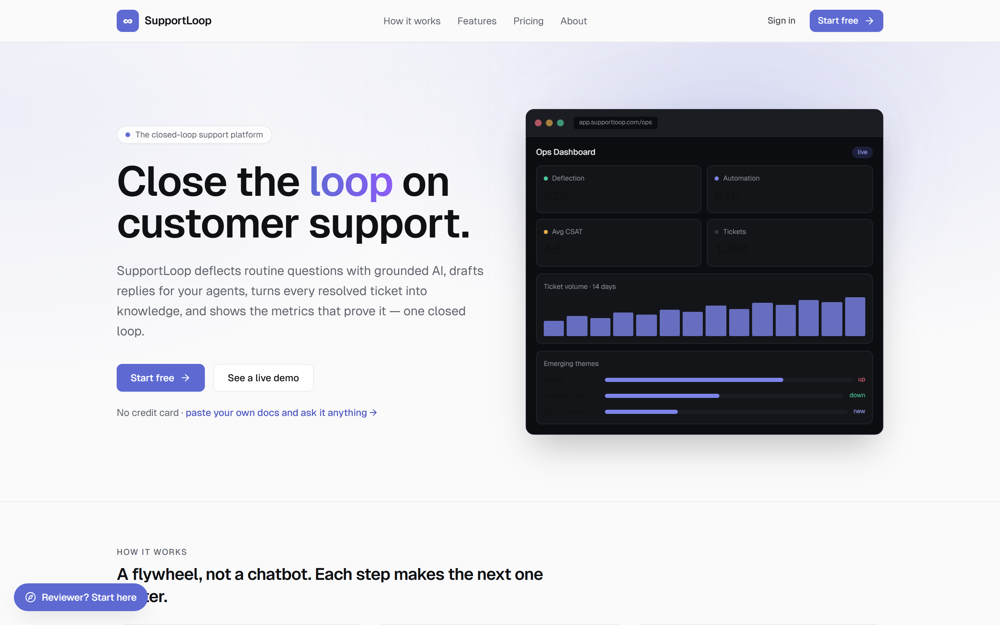
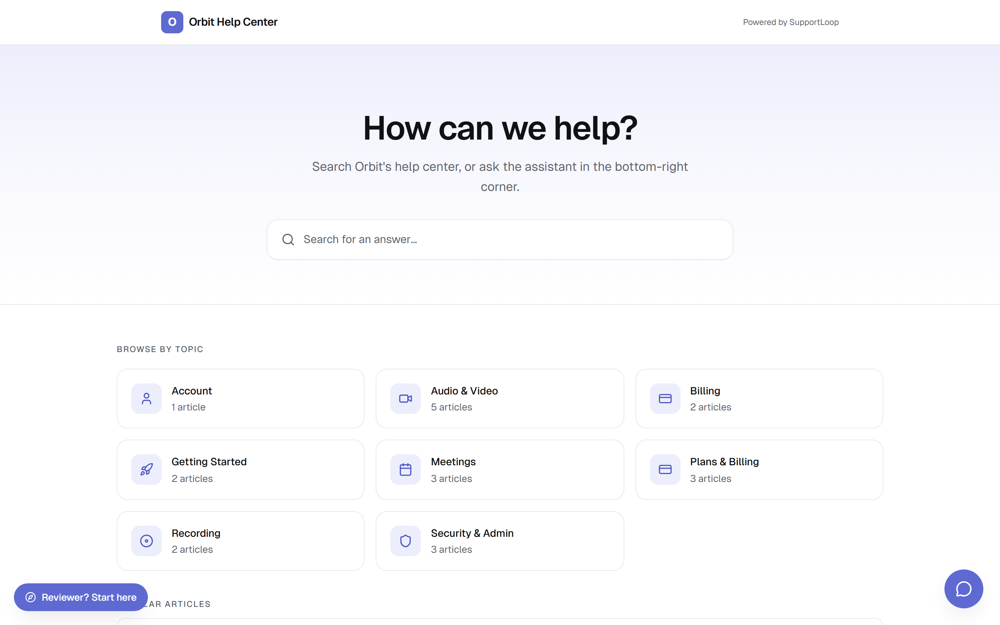
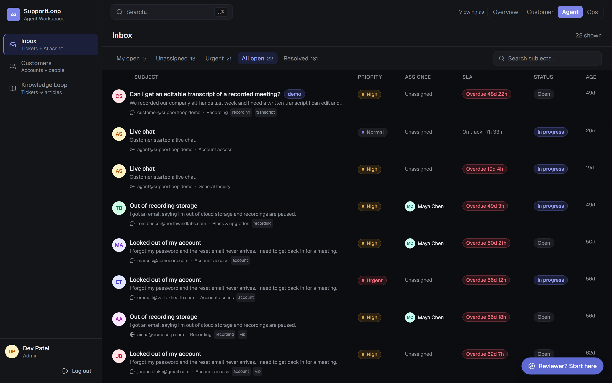
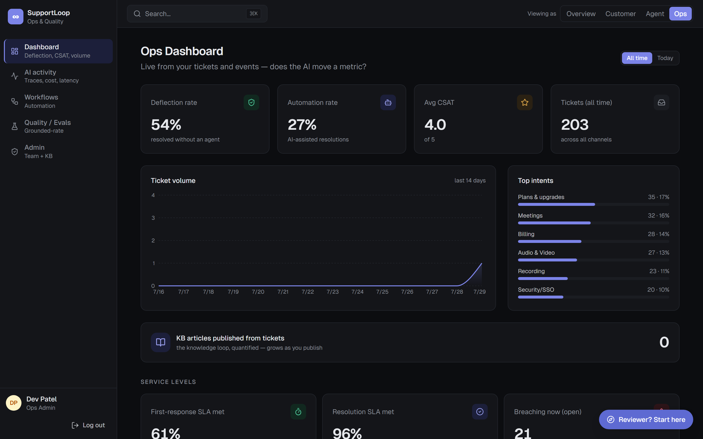
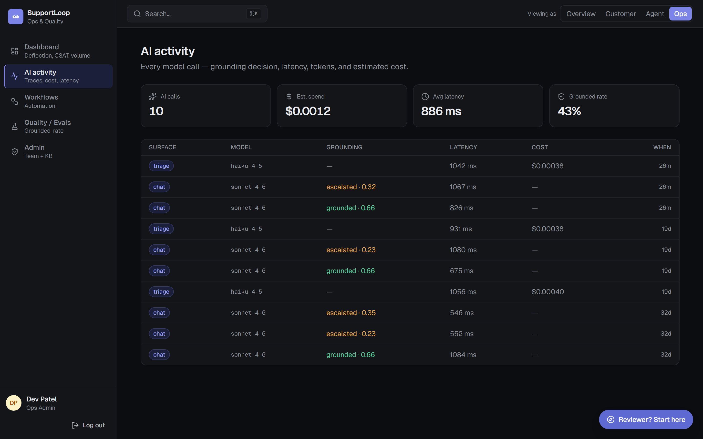
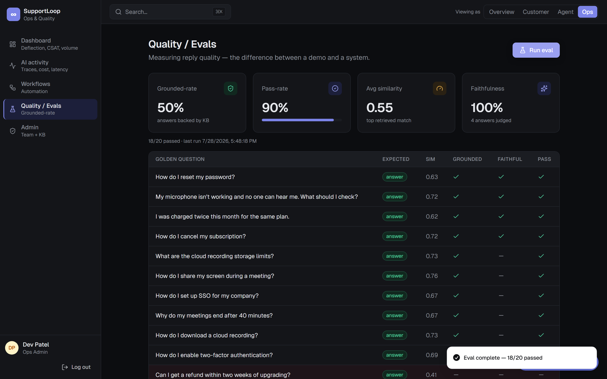

# SupportLoop: AI customer support, as a closed loop

[](https://support.aidancrosbie.com)
[](https://github.com/acrosbie/supportloop/actions/workflows/ci.yml)
   

**SupportLoop is a working, multi-tenant AI customer-support platform.** Not a chatbot demo: the entire support lifecycle as one closed loop, from AI self-service through escalation, agent assist, knowledge generation, ops analytics and community, with every arrow feeding the next.

### ▶ [Try it live at support.aidancrosbie.com](https://support.aidancrosbie.com)

One-click demo logins on `/login`, no signup required. There is a [2-minute guided path](#the-2-minute-guided-path) below, or you can run it locally in about the same time.

---

## Why I built this

I ran customer self-service at Zoom while it scaled from 10 million to 300 million users, sustaining 90%+ deflection across that curve. I know what an operator needs from an AI support system, because I was the operator.

Most engineers build the bot. Few also build the operator's analytics that prove the bot moved a business metric. This builds both, and it treats *grounded, or escalate* as a hard rule rather than a nice-to-have.

The demo is configured for a fictional customer, **Orbit**, a video-collaboration app. The data is invented; the application is real. Sign up and you get your own isolated workspace.

---

## The idea: a flywheel, not a chatbot

```
  ① Customer asks  ─►  ② AI self-service (RAG)  ─►  ③ Escalation → Agent assist
     help center +        grounded answers              AI triage (intent/urgency/
     embeddable widget    deflect from the KB           sentiment) + a grounded
                          (or escalate, never guess)    draft reply to edit & send
                                                              │
   ⑥ Community Q&A                                            ▼
     AI suggests answers      ⑤ Ops dashboard  ◄──  ④ Knowledge loop: the resolved
     from the KB & surfaces      deflection %,          ticket becomes a new KB
     gaps ───────────────►       automation rate,       article (AI-drafted, human-
                  │              CSAT, volume, intents  approved, then published)
                  └──────────────────────────────────────────────┘
                         gaps + resolutions become the next articles,
                         which deflect the next question. The loop closes.
```

Every published article immediately improves retrieval, so the next identical question deflects instead of opening a ticket. That feedback loop is the whole point.

---

## Screenshots

<table>
  <tr>
    <td width="50%"><br/><sub>Marketing home</sub></td>
    <td width="50%"><br/><sub>Customer help center, grounded self-service</sub></td>
  </tr>
  <tr>
    <td><br/><sub>Agent inbox: triage, SLAs, assignment</sub></td>
    <td><br/><sub>Ops dashboard: deflection, automation, CSAT</sub></td>
  </tr>
  <tr>
    <td><br/><sub>AI activity: per-call cost, latency, grounding</sub></td>
    <td><br/><sub>Quality and evals: grounded-rate and faithfulness</sub></td>
  </tr>
</table>

<sub>Captured from the live demo with <code>scripts/screenshots.ts</code> (Playwright), so they stay current.</sub>

---

## Engineering decisions worth calling out

- **Grounded, or it escalates.** Generation is constrained to retrieved KB. The grounding guardrail (`lib/guardrail.ts`) compares the top cosine similarity to a threshold (**0.60**), and below it the surface escalates to a human instead of inventing a refund or security policy. The threshold was *tuned to the data*: `voyage-3-lite`'s compressed range puts uncovered topics around 0.56 and well-covered ones around 0.62, so 0.60 cleanly separates them.
- **A real eval harness, not vibes.** `/api/eval` runs a golden set through the actual retrieval pipeline and checks that "answer" questions ground above threshold while "escalate" questions fall below. That is the regression gate you would put on every prompt, model, or KB change. An LLM-as-judge faithfulness check runs alongside it.
- **Multi-tenancy that is actually isolated.** Every table carries `org_id`, and the invariant is enforced structurally: all ~70 exports in `lib/data.ts` take `orgId` as their first argument, and **`match_kb()` is org-scoped in SQL**, so one workspace's chatbot cannot retrieve another's knowledge even if a caller forgets. Postgres RLS sits behind that as defense in depth.
- **Streaming with a metadata side-channel.** Answers stream token by token via a `ReadableStream`, and the grounding decision (confidence plus cited sources) rides along in an `x-grounding` response header, so the UI renders citations and a confidence state without buffering the response.
- **LLM steps as composable automation.** The workflow engine treats classify, summarize, draft, and extract-to-custom-field as ordinary steps in a rule sequence, sitting next to deterministic actions like assign or escalate. Runs execute after the response via `waitUntil`, so automation never blocks the request.
- **AI observability from day one.** Every model call records cost, latency, token counts, and its grounding decision, which is what makes the quality dashboard possible rather than aspirational.
- **Human in the loop by design.** AI drafts; humans approve. KB articles never auto-publish, and agent replies are always editable before send.
- **Keys never reach the browser.** All AI and DB calls run in server route handlers. The client only ever talks to first-party routes.
- **Public-demo cost guard.** LLM routes are rate-limited per IP with a global daily ceiling (`lib/ratelimit.ts`, enforced in `middleware.ts`), so the hosted demo cannot be scripted into a surprise bill. It disables itself when unconfigured, so local dev is unaffected.

---

## What it does

**Customer surface** (light, Zendesk/Freshdesk-grade)
- Searchable help center plus a **RAG chatbot** that answers from the knowledge base and **escalates honestly** when it cannot. It never invents policy.
- **Live chat** with presence and typing indicators (Supabase Realtime), escalated to from inside the chatbot rather than a separate tab.
- A **community forum** where AI suggests grounded answers and flags knowledge gaps.
- A "submit a request" web form and a per-customer ticket portal.

**Agent console** (dark, Linear-style)
- A **triaged inbox**: intent, urgency, sentiment, priority, SLA state, routing.
- A **grounded draft reply** on every ticket, ready to edit and send, plus canned macros.
- **Agent copilot**: ticket summary, suggested next action, similar past tickets.
- **Agentic tool-use**: the model investigates via back-office tools and proposes an action (for example a refund) for human approval.
- The **knowledge loop**: turn a resolved ticket into a reusable article, AI-drafted, human-approved, published, then re-embedded.
- **Customers and accounts** as first-class objects with relationship views, so a ticket carries who is asking and what they are worth.

**Ops and quality**
- A dashboard of the metrics that matter: **deflection, automation rate, CSAT, volume, top intents, KB-from-tickets**. The business view that proves the AI moved a number.
- An **SLA engine** with first-response, next-response and resolution clocks, targets derived from priority and account plan, compliance KPIs, and a breach sweep run by Vercel cron.
- **Evals and faithfulness** scoring, and **AI observability** with per-call cost, latency and grounding traces.
- **AI insights**: emerging themes and a weekly narrative generated from ticket volume.

**Automation**
- A **workflow engine** with five triggers (`ticket.created`, `csat.submitted`, `status.changed`, `sla.breach`, `webhook.received`), rule conditions over any ticket, customer or account field including custom fields, and both deterministic and LLM steps that can mutate the ticket, the customer and the account.
- A **visual builder** plus per-ticket automation history. Example rule: low CSAT escalates the ticket and flips the account to at-risk.

**Platform** (it is a real multi-tenant SaaS)
- **Organizations** with full data isolation. A real signup gets an empty workspace and an onboarding wizard.
- **RBAC**: agent groups with group roles, customer account roles, and a pure permission model (`lib/rbac.ts`) enforced across KB, ops, custom fields, settings and team, with a `can()` test suite.
- **Custom fields**: an admin builder (text, number, select, date, checkbox) for customers, accounts, tickets and docs, editable inline everywhere.
- **Integrations**: an inbound **webhook** (`POST /api/hooks/<slug>`, per-org secret), a **provisioning API** (`POST /api/v1/accounts|customers|tickets`, per-org API key), and an Intercom-style **JWT identity handshake** so a customer's own logged-in users arrive already identified, with their customer and account auto-provisioned on first contact.
- **Bring your own knowledge** via Markdown import, an **embeddable `<script>` chat widget** scoped per workspace, per-org **hosted help centers** at `/help/<slug>`, and custom-domain configuration.
- It **dogfoods itself**: a SupportLoop workspace runs its own support on SupportLoop.

---

## The 2-minute guided path

1. **Deflect vs. escalate.** From the home, open the Help Center and ask the assistant something the KB covers, and you get a grounded answer **with citations**. Ask something it does not cover (try *"can I get an editable transcript of a meeting?"*) and it declines to guess, then **offers a ticket**.
2. **Close the loop.** One-click sign in as the **Agent**, open the flagged "demo" ticket, run **AI triage**, **draft a grounded reply**, resolve, then **Knowledge Loop** to draft an article from the ticket and **publish** it. Re-ask the chatbot. Now it deflects. 🔁
3. **The business view.** Sign in as **Admin**, then **Ops** for deflection, automation and CSAT, **Quality** to run the evals, and **Admin** to import a KB, grab the widget snippet, or manage the team.
4. **Multi-tenancy in one glance.** Compare `/help/orbit` and `/help/supportloop`: two real, **isolated** help centers from one platform. Or sign up a new workspace and watch it start empty and private.

---

## Architecture

```
 Next.js 14 App Router (RSC) ───────────────────────────────────────────────
   /user  · customer help center (light)     /agent · /ops · admin (dark)
   /help/[slug] · hosted help centers         /widget + /embed.js · embeddable
        │                                            │
        ▼  server route handlers (keys stay server-side)
   ┌──────────────────────────────────────────────────────────────────┐
   │  RAG pipeline                          AI (Anthropic Claude)        │
   │  Voyage voyage-3-lite embeddings  ┌──  generate: claude-sonnet-4-6  │
   │           │                       │    classify: claude-haiku-4-5   │
   │           ▼                       │    streamed (ReadableStream)    │
   │  pgvector match_kb() (cosine,     │                                 │
   │  org-scoped)  ──► grounding       │                                 │
   │  guardrail (threshold 0.60)  ─────┘  grounded → answer + citations  │
   │                                       below → escalate to a human   │
   └──────────────────────────────────────────────────────────────────┘
        │
        ▼  Supabase Postgres + pgvector — every row scoped by org_id (RLS + app-level)
   organizations · profiles · kb_articles · tickets · ticket_messages ·
   accounts · customers · workflows · workflow_runs · community_* ·
   groups · custom_field_defs · events · eval_runs · canned_responses
```

**Stack:** Next.js 14 (App Router, RSC) · TypeScript strict · Tailwind with a bespoke token system (light customer, dark operator) · Supabase Postgres + **pgvector** · `@supabase/ssr` cookie auth · **Anthropic Claude** (Sonnet 4.6 generate, Haiku 4.5 classify, streamed) · **Voyage** `voyage-3-lite` embeddings (512-dim) · Upstash rate limiting · Recharts · Vercel.

**Testing:** vitest unit suites over the pure modules (guardrail, RBAC, SLA, and more), with GitHub Actions running lint, test and build on every push and pull request.

---

## Scope and limits

Built solo, on the side, in about a week of evenings and weekends (six days of commits, which the git history will confirm). The feature list above is the honest scope of what that produced. What it is not is an enterprise deployment, and the gap between the two is mostly the unglamorous parts. Knowing them is half the job:

- **Evals become graded sets per intent**, with regression gates wired into CI on every prompt or model bump. What is here is a single grounded-rate starter plus a faithfulness judge.
- **PII and safety:** redaction before the model ever sees a message, scoped retention, audit logging. Out of scope against fictional data, mandatory against real data.
- **Tenant hardening:** RLS policies tightened to the JWT `org_id` beneath the app-level scoping. Today the app runs on the service-role key and the isolation guarantee is the `lib/data.ts` invariant plus org-scoped SQL functions.
- **Knowledge ingestion at scale:** native Zendesk and Intercom sync, crawl and re-embed on change, a chunking strategy per document type.
- **Cost and latency:** cached embeddings, cheap-model routing for easy intents, streaming everywhere, and measuring deflection as dollars saved.

Where this repo cuts a corner, it is listed here rather than hidden.

**What I would build next** is tracked in [docs/ROADMAP.md](docs/ROADMAP.md).

---

## Run it locally

```bash
npm install
cp .env.example .env.local   # fill in the keys below
# apply supabase/migrations/0001…0012 in the Supabase SQL editor, in order
npm run seed                 # seeds the Orbit demo + SupportLoop dogfood org
npm run dev
```

```bash
npm test        # vitest unit suites
npm run lint
npm run build
```

**Env (`.env.local`, all server-side except the public Supabase URL and anon key):**

| Var | What | Required |
|---|---|---|
| `ANTHROPIC_API_KEY` | Claude (generate + classify) | yes |
| `VOYAGE_API_KEY` | embeddings (`voyage-3-lite`) | yes |
| `NEXT_PUBLIC_SUPABASE_URL` / `NEXT_PUBLIC_SUPABASE_ANON_KEY` | Supabase client | yes |
| `SUPABASE_SERVICE_ROLE_KEY` | server-side data access, never exposed | yes |
| `CRON_SECRET` | bearer token for the scheduled SLA sweep | yes in production |
| `NEXT_PUBLIC_SITE_URL` | base URL for OG tags + the widget snippet | optional |
| `UPSTASH_REDIS_REST_URL` / `UPSTASH_REDIS_REST_TOKEN` | demo cost guard, disabled when unset | optional |

Demo logins are one-click on `/login`.

---

## About

A reference implementation built to demonstrate the full AI-support lifecycle end to end. **Orbit** is fictional; the data is invented; the application is real.

Built by **Aidan Crosbie**, a customer-experience technology leader moving into AI and automation for CX. MIT licensed.
